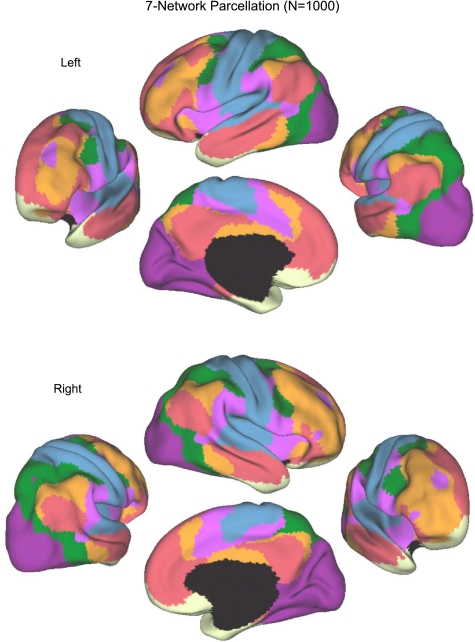
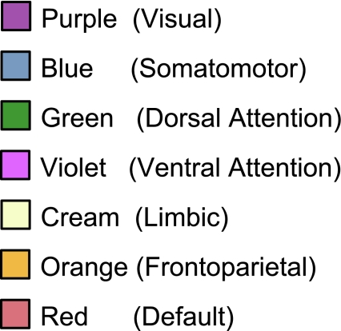

# MindMap - Interactive 3D Brain Viewer

An interactive 3D viewer for exploring the seven Yeo et al. (2011) functional brain networks. Hover or click a network to read accurate summaries, functions, and resources.

## Atlas

This project uses the 7-Network functional atlas from Yeo et al. (2011), derived from resting-state fMRI on 1,000 subjects to estimate intrinsic functional connectivity across the cortex. The 7 networks (VIS, SMN, DAN, VAN/Salience, Limbic, Frontoparietal/Control, Default Mode) offer a widely adopted, biologically meaningful yet concise framework for interactive exploration and education.

Citation: Yeo, B.T.T., Krienen, F.M., Sepulcre, J., Sabuncu, M.R., Lashkari, D., Hollinshead, M., … Buckner, R.L. (2011). The organization of the human cerebral cortex estimated by intrinsic functional connectivity. Journal of Neurophysiology, 106(3), 1125–1165. https://doi.org/10.1152/jn.00338.2011

Why this atlas?
- Robust and validated across a large cohort
- Clear, interpretable networks for education and demos
- Balanced granularity (7-network) for clean UI and interaction

How to use it in the app:
- Hover over the 3D brain to highlight the nearest network
- Click to open details, functions, and resources
- Use search to jump to a specific network
- Drag to rotate, scroll to zoom

## Visual overview

### Interactive scene



### Network legend



## Requirements

- Node.js (LTS) and npm
- Project dependencies listed in `package.json`

## Quick start

1. Install dependencies:

```bash
npm install
```

2. Start the development server and follow the CLI output for the local address:

```bash
npm run dev
```

3. Build for production:

```bash
npm run build
```

## Project structure (relevant files)

- `src/` — React source files
  - `main.jsx`, `App.jsx`, `App.css`
  - `components/` — key components (e.g. `GltfBrainModel.jsx`, `RealisticBrainGeometry.jsx`)
- `public/` — static assets served at runtime
- `human-brain/` — source data and textures

## Adding real brain models

Place model and atlas files under `public/models/`. The app expects static assets to be served from `/models/*`.

Common steps:
- Convert surfaces to a web-friendly format (OBJ or glTF). FreeSurfer surfaces can be converted with `mris_convert`.
- Provide a vertex-to-region mapping (atlas) and load it at runtime to resolve clicked faces to region labels.

## Notes for developers

- The viewer uses Three.js via `@react-three/fiber` and standard loaders (OBJ/glTF).
- Raycasting is used to map clicks to mesh faces; atlas lookup is required to map a face/vertex to a region.
- The local dev server address is printed by the dev script — do not rely on a hard-coded port.

## Deployment

- Build with `npm run build` and deploy the `dist/` output (Vercel, Netlify, etc.). Follow your chosen host's instructions.

## Licence

This repository contains code and assets for research and demonstration. Check the project `package.json` for any third-party licence requirements.

---

For implementation details consult the source files in `src/components/`.

